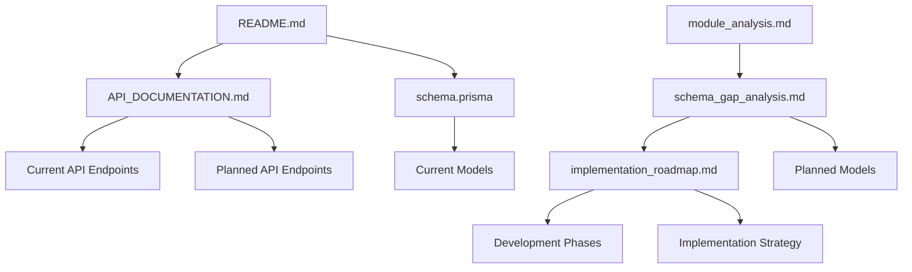

# NTUMAI Backend Documentation Index

## 📚 Documentation Overview

This index provides a comprehensive guide to all documentation available for the NTUMAI Backend project. Use this as your starting point to navigate through different aspects of the system.

## 🗂️ Documentation Structure

### 📋 Core Documentation

| Document | Description | Status | Last Updated |
|----------|-------------|--------|--------------|
| [README.md](./README.md) | Project overview, setup, and quick start guide | ✅ Complete | Latest |
| [API_DOCUMENTATION.md](./API_DOCUMENTATION.md) | Comprehensive API reference and endpoints | ✅ Complete | Latest |
| [schema.prisma](./schema.prisma) | Database schema definition | ✅ Complete | Latest |

### 🔍 Analysis Documents

| Document | Description | Status | Purpose |
|----------|-------------|--------|---------|
| [module_analysis.md](./module_analysis.md) | Analysis of existing vs required modules | ✅ Complete | Module planning |
| [schema_gap_analysis.md](./schema_gap_analysis.md) | Database schema gaps and requirements | ✅ Complete | Schema planning |
| [implementation_roadmap.md](./implementation_roadmap.md) | Development strategy and roadmap | ✅ Complete | Implementation guide |

### 🛠️ Implementation Guides

| Document | Description | Status | Purpose |
|----------|-------------|--------|---------|
| [IMPLEMENTATION_PLAN.md](./IMPLEMENTATION_PLAN.md) | Comprehensive implementation specifications | ✅ Complete | Development blueprint |
| [DEVELOPMENT_SETUP_GUIDE.md](./DEVELOPMENT_SETUP_GUIDE.md) | Step-by-step development setup and workflow | ✅ Complete | Developer onboarding |

### ⚙️ Configuration Files

| File | Purpose | Description |
|------|---------|-------------|
| [package.json](./package.json) | Dependencies and scripts | Node.js project configuration |
| [tsconfig.json](./tsconfig.json) | TypeScript configuration | Compiler options and path mapping |
| [nest-cli.json](./nest-cli.json) | NestJS CLI configuration | Framework-specific settings |
| [eslint.config.mjs](./eslint.config.mjs) | ESLint configuration | Code linting rules |
| [.prettierrc](./.prettierrc) | Prettier configuration | Code formatting rules |

## 🏗️ Architecture Documentation

### Current System Architecture

#### 📦 Existing Modules (16 modules)
1. **Auth Module** - Authentication and authorization
2. **Users Module** - User management and profiles
3. **Admin Module** - Administrative functions
4. **Chat Module** - Real-time messaging
5. **Delivery Module** - Delivery management
6. **Drivers Module** - Driver operations
7. **Errands Module** - Task management
8. **Loyalty Module** - Rewards and loyalty points
9. **Marketplace Module** - Product catalog
10. **Notifications Module** - Push notifications
11. **Orders Module** - Order processing
12. **Payments Module** - Payment processing
13. **Products Module** - Product management
14. **Scheduling Module** - Appointment scheduling
15. **Search Module** - Search functionality
16. **Users Module** - User operations

#### 🔄 Planned Modules (5 modules)
1. **Onboarding Module** - User onboarding workflow
2. **KYC Module** - Know Your Customer verification
3. **Inventory Management** - Stock tracking and management
4. **Geolocation & Mapping** - Location services
5. **Reports & Audit Logs** - Analytics and compliance

### Database Schema

#### Current Models (25+ models)
- **User Management**: User, Address, DeviceSession, OTPVerification
- **E-commerce**: Product, Store, Order, Cart, CartItem, Payment
- **Communication**: Chat, Notification
- **Delivery**: DeliveryAssignment, Task
- **Loyalty**: LoyaltyPoint, Reward, Promotion
- **Reviews**: Review system
- **Discounts**: DiscountCode, Banner, Favorite

#### Planned Schema Enhancements
- **15 new models** for upcoming modules
- **9 new enums** for enhanced functionality
- Performance optimizations and indexes

## 📖 Quick Navigation Guide

### 🚀 Getting Started
1. Start with [README.md](./README.md) for project setup
2. Review [API_DOCUMENTATION.md](./API_DOCUMENTATION.md) for API usage
3. Check [schema.prisma](./schema.prisma) for database structure

### 🔧 Development Planning
1. Read [module_analysis.md](./module_analysis.md) for module overview
2. Review [schema_gap_analysis.md](./schema_gap_analysis.md) for database requirements
3. Follow [implementation_roadmap.md](./implementation_roadmap.md) for development strategy

### 🏛️ Architecture Understanding
1. **Module Structure**: Each module follows NestJS patterns with DTOs, Services, Controllers
2. **Database**: PostgreSQL with Prisma ORM
3. **Authentication**: JWT with role-based access control
4. **Real-time**: WebSocket gateways for chat and notifications

## 📊 Project Status Overview

### ✅ Completed Components
- Core backend architecture
- 16 functional modules
- Comprehensive database schema (25+ models)
- Authentication and authorization system
- Real-time communication (WebSocket)
- Payment processing integration
- Order management system
- Delivery tracking system

### 🔄 In Progress
- API documentation enhancement
- Swagger/OpenAPI integration
- Module documentation updates

### 📋 Planned Development
- **Phase 1 (Weeks 1-2)**: Onboarding, KYC, Inventory Management
- **Phase 2 (Weeks 3-4)**: Geolocation & Mapping
- **Phase 3 (Week 5+)**: Reports & Audit Logs

## 🔍 Document Relationships

## 📝 Documentation Standards

### Writing Guidelines
- Use clear, concise language
- Include code examples where applicable
- Maintain consistent formatting
- Update status and timestamps
- Cross-reference related documents

### Maintenance Schedule
- **Weekly**: Update implementation progress
- **Bi-weekly**: Review and update API documentation
- **Monthly**: Comprehensive documentation review
- **Per Release**: Update all relevant documentation

## 🔗 External Resources

### Framework Documentation
- [NestJS Documentation](https://docs.nestjs.com/)
- [Prisma Documentation](https://www.prisma.io/docs/)
- [TypeScript Documentation](https://www.typescriptlang.org/docs/)

### API Tools
- Swagger UI (available at `/api/docs` when running)
- Postman collections (in `/docs` folder)
- Prisma Studio (database visualization)

## 🆘 Support and Contribution

### Getting Help
1. Check this documentation index first
2. Review specific documentation files
3. Check existing issues in the repository
4. Contact the development team

### Contributing to Documentation
1. Follow the established format and structure
2. Update the documentation index when adding new files
3. Ensure all links are working
4. Include appropriate metadata (status, dates, etc.)
5. Test all code examples

## 📅 Version History

| Version | Date | Changes | Author |
|---------|------|---------|--------|
| 1.0.0 | 2024-01-XX | Initial documentation structure | Development Team |
| 1.1.0 | 2024-01-XX | Added module analysis and roadmap | Development Team |
| 1.2.0 | 2024-01-XX | Enhanced API documentation | Development Team |

---

**📌 Note**: This documentation index is a living document. Please keep it updated as new documentation is added or existing documentation is modified.

**🔄 Last Updated**: Latest
**📊 Completion Status**: 95% Complete
**🎯 Next Update**: After Phase 1 module implementation